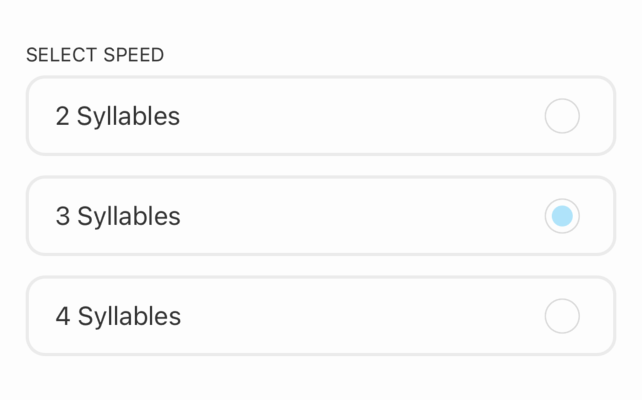

# RadioButtonGrid

A grid of radio buttons with labels attached. Only one can be selected.

## Usage example:

```typescript jsx
const speedOptions = ['2 Syllables', '3 Syllables', '4 Syllables'];
const [selectedSpeedOptionsIndex, setselectedSpeedOptionsIndex] = useState(0);
```

```typescript jsx
<RadioButtonGrid
    items={speedOptions}
    label={'Select speed'}
    onSelect={newValue => {
        setselectedSpeedOptionsIndex(newValue)
    }}
    selectedItemIndex={selectedSpeedOptionsIndex}
/>
```

## Output:

You could then use `selectedSpeedOptionsIndex`. In this example, it would be `1`—the second option (index of 1) is selected.


